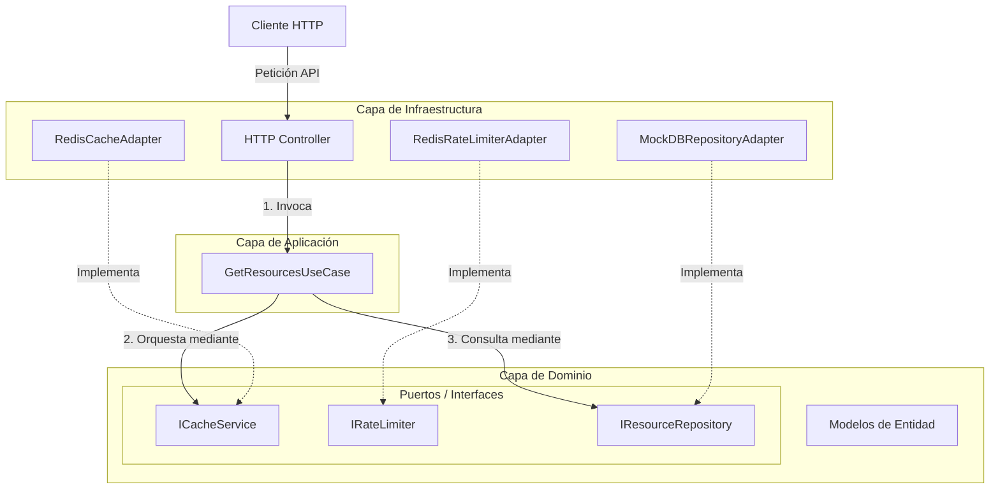
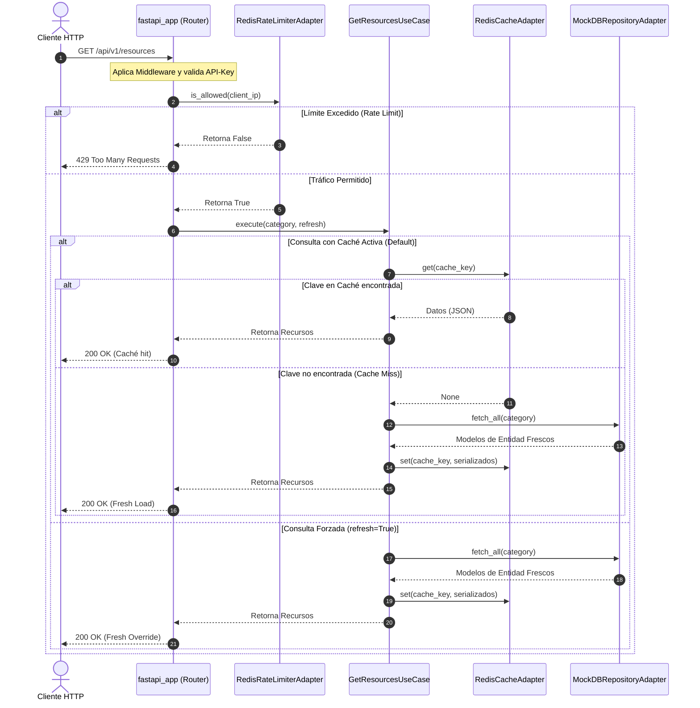
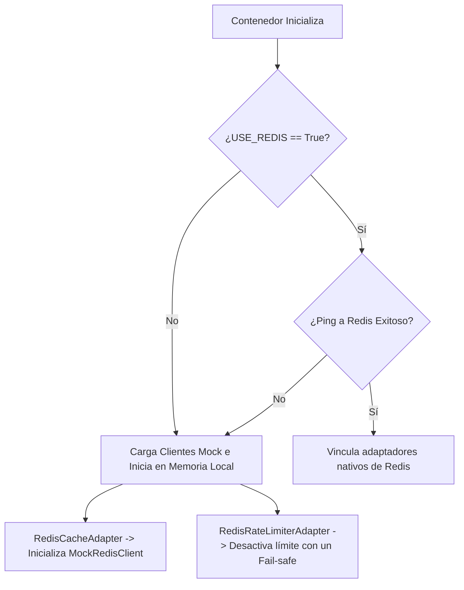

# Documentación Técnica: Arquitectura Hexagonal y Flujo de Peticiones

Este documento detalla la estructura arquitectónica, el flujo de ejecución de peticiones y los mecanismos de contingencia (failover) implementados en la API.

---

## 1. Estructura de la Arquitectura Hexagonal

Esta aplicación utiliza la **Arquitectura Hexagonal (Puertos y Adaptadores)** para aislar la lógica del negocio de los detalles tecnológicos e infraestructura externa (como frameworks web, bases de datos o sistemas de caché).

### Capas:
1. **Dominio (Núcleo Puro):** Define las reglas del negocio, entidades ([models.py](src_python/domain/models.py)) y los contratos que regulan la salida/entrada de datos ([repository_ports.py](src_python/domain/repository_ports.py)). No tiene dependencias de librerías externas.
2. **Aplicación (Casos de Uso):** Contiene la lógica orquestadora específica de cada acción ([get_resources_use_case.py](src_python/application/get_resources_use_case.py)). Consume los puertos del dominio.
3. **Infraestructura (Adaptadores):** Implementa los puertos definidos en el Dominio. Aquí interactuamos con bases de datos, Redis para caché y librerías web como FastAPI.

---

## 2. Flujo de una Petición (Request Flow)

Cuando un cliente hace una llamada GET al endpoint `/api/v1/resources`, se desencadena la siguiente secuencia:

### Detalle del Flujo de Ejecución:
1. **Entrada y Seguridad:** La petición pasa por [fastapi_app.py](src_python/infrastructure/fastapi_app.py) para evaluar excepciones generales, CORS y verificar cabeceras del token de autenticación.
2. **Rate Limiting:** El router de la API ([fastapi_controller.py](src_python/infrastructure/http/fastapi_controller.py)) llama a `is_allowed()` del adaptador `RedisRateLimiterAdapter`.
3. **Caso de Uso:** Si se aprueba, se delega al caso de uso `GetResourcesUseCase`.
4. **Caché Térmica:** Éste valida si el recurso consultado ya se encuentra serializado en el servicio de caché:
   - **Caso Positivo:** Retorna los datos inmediatamente, evitando consultas costosas.
   - **Caso Negativo:** Consulta el repositorio de datos de infraestructura (`MockDBRepositoryAdapter`), actualiza la caché para futuras consultas y finalmente retorna los datos al controller.

---

## 3. Comportamiento en Modo Failover (Redis Caído o Desactivado)

Una particularidad del diseño es que la aplicación **nunca se interrumpe** si Redis se apaga o si se desactiva en el archivo `.env` (`USE_REDIS=False`). 

Esto se gestiona a través del contenedor de Inyección de Dependencias en [container.py](src_python/infrastructure/container.py):

### Lógica de Recuperación Dinámica:
* **Adaptador de Caché en Memoria:** Ante un timeout en la conexión durante el inicio o ciclo de ejecución, [redis_cache_adapter.py](src_python/infrastructure/adapters/redis_cache_adapter.py) atrapa la excepción `redis.TimeoutError` o `redis.ConnectionError` y sustituye dinámicamente la instancia del cliente `redis.Redis` por un diccionario interno `MockRedisClient` almacenado en memoria RAM local.
* **Adaptador de Rate Limiting Tolerante a Fallos:** Ante caídas de conexión, [redis_rate_limiter_adapter.py](src_python/infrastructure/adapters/redis_rate_limiter_adapter.py) inhabilita internamente el bloqueo de tráfico convirtiéndose en un passthrough permisivo (`_available = False`), garantizando que la API continúe respondiendo peticiones legítimas de forma ininterrumpida.
