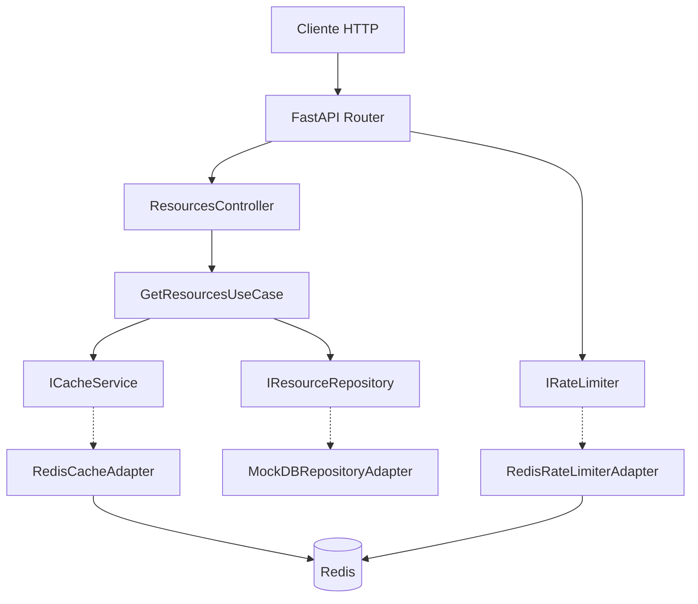
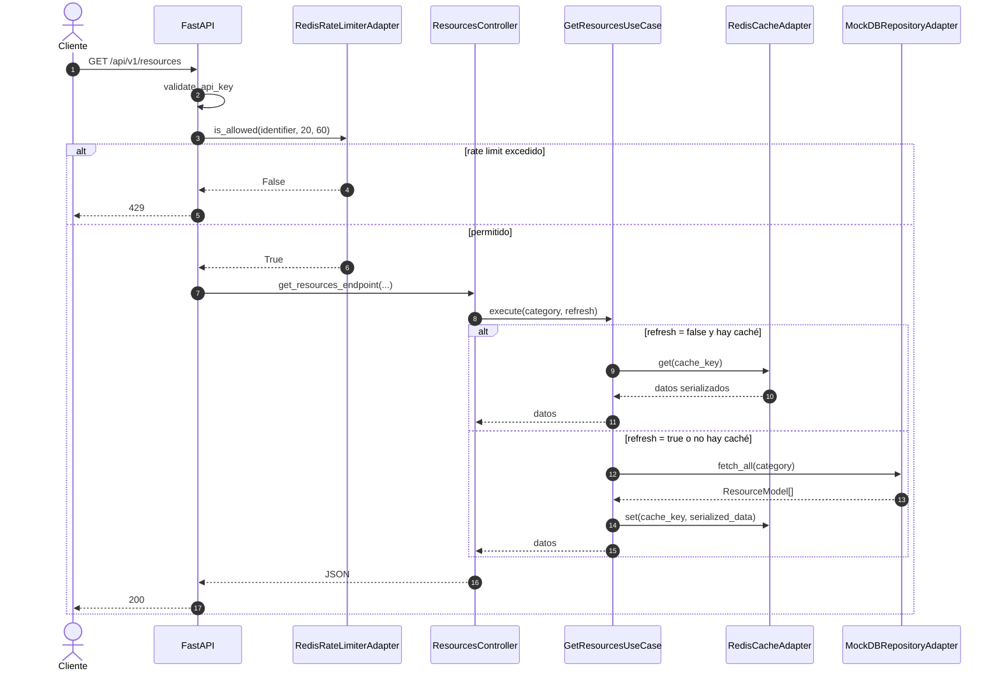
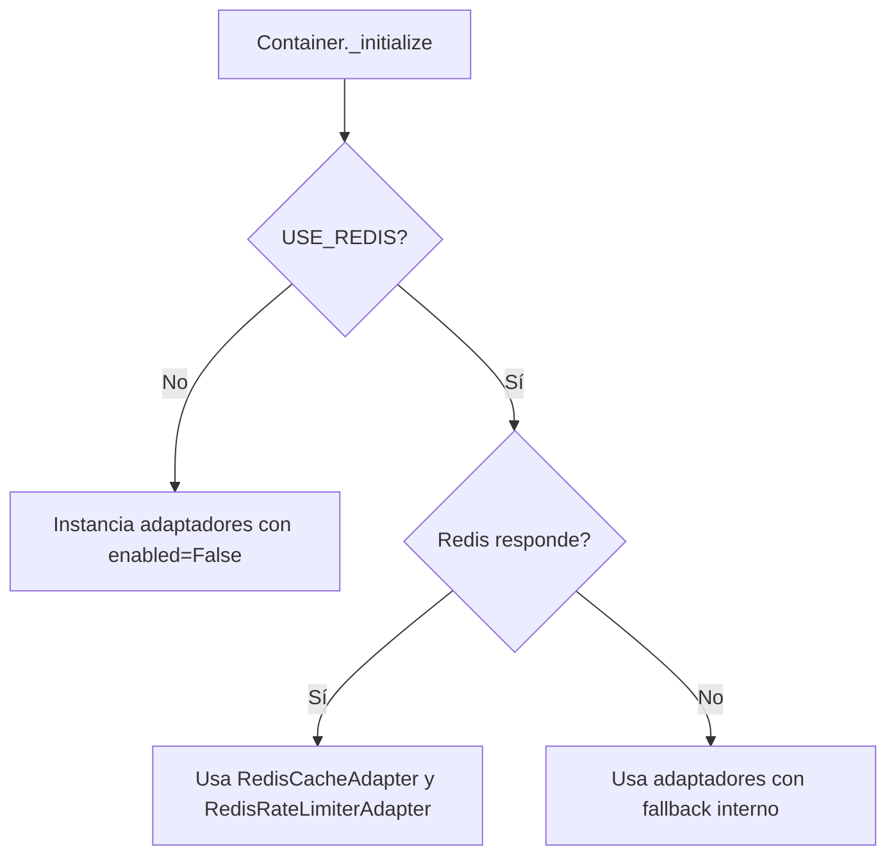

# Documentación Técnica: Arquitectura Y Flujo Real Del Proyecto

Este documento describe la arquitectura actual del backend tal como existe hoy en el repositorio: un slice centrado en recursos, caché opcional con Redis, rate limit y exposición HTTP con FastAPI.

## 1. Capas Y Responsabilidades

La aplicación sigue una arquitectura hexagonal mínima.



### Dominio

- [src_python/domain/models.py](src_python/domain/models.py): modelos de entidad usados por la app.
- [src_python/domain/repository_ports.py](src_python/domain/repository_ports.py): contratos para repositorio, caché y rate limit.
- [src_python/domain/helpers/financial_parser_helper.py](src_python/domain/helpers/financial_parser_helper.py): parsing numérico y de fechas.

### Aplicación

- [src_python/application/get_resources_use_case.py](src_python/application/get_resources_use_case.py): caso de uso que obtiene recursos, consulta caché y serializa respuesta.

### Infraestructura

- [src_python/infrastructure/fastapi_app.py](src_python/infrastructure/fastapi_app.py): instancia FastAPI, CORS, seguridad, docs protegidas y lifespan.
- [src_python/infrastructure/container.py](src_python/infrastructure/container.py): resolución de dependencias y estrategia Redis vs fallback.
- [src_python/infrastructure/adapters/mock_db_repository_adapter.py](src_python/infrastructure/adapters/mock_db_repository_adapter.py): repositorio in-memory actual.
- [src_python/infrastructure/adapters/redis_cache_adapter.py](src_python/infrastructure/adapters/redis_cache_adapter.py): caché Redis con mock local cuando aplica.
- [src_python/infrastructure/adapters/redis_rate_limiter_adapter.py](src_python/infrastructure/adapters/redis_rate_limiter_adapter.py): rate limit Redis con modo permisivo cuando Redis falla o se desactiva.
- [src_python/infrastructure/http/routes.py](src_python/infrastructure/http/routes.py): definición de endpoints.

## 2. Superficie HTTP Actual

La aplicación expone un único router principal bajo `/api/v1`.

### Endpoints

- `GET /api/v1/status`
- `GET /api/v1/resources`
- `POST /api/v1/resources/parse-value`
- `GET /docs`
- `GET /redoc`

Observación importante:

- Los endpoints bajo `/api` heredan la dependencia global `validate_api_key` configurada en [src_python/infrastructure/fastapi_app.py](src_python/infrastructure/fastapi_app.py).
- `/docs` y `/redoc` usan `validate_swagger_auth` y no se publican como docs abiertas.

## 3. Flujo De `GET /api/v1/resources`



## 4. Seguridad

### API Key

Implementada en [src_python/infrastructure/fastapi_app.py](src_python/infrastructure/fastapi_app.py).

- Cabecera: `X-API-Key`
- En `development`: bypass permitido.
- En `production`: cabecera ausente devuelve `401`; valor incorrecto devuelve `403`.

### Basic Auth para documentación

- `GET /docs`
- `GET /redoc`

Comparan usuario y password con `secrets.compare_digest` usando `SWAGGER_USERNAME` y `SWAGGER_PASSWORD`.

## 5. Redis, Fallback Y Arranque

El comportamiento actual del contenedor es el siguiente:



Detalles reales:

- Si `USE_REDIS=False`, [src_python/infrastructure/container.py](src_python/infrastructure/container.py) evita el `ping()` y crea directamente fallback local.
- Si `USE_REDIS=True` pero Redis no responde, el boot no cae; usa los adaptadores con sus propios mecanismos de contingencia.
- `RedisCacheAdapter(enabled=False)` crea `MockRedisClient` en memoria.
- `RedisRateLimiterAdapter(enabled=False)` queda con `_available = False`, por lo que permite el tráfico.

## 6. Lifespan Y Worker Proactivo

El lifecycle se define en [src_python/infrastructure/fastapi_app.py](src_python/infrastructure/fastapi_app.py).

- En `development` no se crea el worker proactivo.
- En otros entornos se crea `proactive_cache_worker_loop()`.
- Si Redis está desactivado, el worker sigue pudiendo ejecutar refresh directo del caso de uso.

## 7. Configuración De Puerto Y Despliegue

- [src_python/infrastructure/config.py](src_python/infrastructure/config.py) define `PORT`.
- [app.py](app.py) ejecuta Uvicorn usando `settings.PORT`.
- [docker-compose.yml](docker-compose.yml) publica `${PORT:-8000}:${PORT:-8000}`.

Consecuencia:

- El mismo contenedor puede levantarse en distintos puertos sin editar código.

## 8. Limitaciones Actuales Del Proyecto

El repo actual no incluye:

- persistencia real con base de datos;
- módulos de emergencia reportados en documentación previa o reportes externos;
- pruebas HTTP end-to-end en la carpeta `tests/`.

Lo que sí existe hoy:

- pruebas unitarias del helper financiero y del caso de uso principal;
- repositorio mock en memoria;
- endpoints de recursos y parseo;
- documentación Swagger/ReDoc protegida.

## 9. Ejemplos HTTP

### Health check

Request:

```bash
curl -X GET "http://localhost:8000/api/v1/status" -H "X-API-Key: secure_apivenezuelaearthquake_key_v1_high_performance"
```

Response:

```json
{
    "status": "healthy",
    "message": "La API corre de manera óptima utilizando Arquitectura Hexagonal.",
    "version": "1.0.0"
}
```

### Listar recursos

Request:

```bash
curl -X GET "http://localhost:8000/api/v1/resources" -H "X-API-Key: secure_apivenezuelaearthquake_key_v1_high_performance"
```

Response de ejemplo:

```json
[
    {
        "id": "res_01",
        "name": "Servicio de Autenticación Central",
        "description": "Clúster SSO integrado con soporte JWT.",
        "category": "Sistemas",
        "created_at": "2026-06-30T10:00:00",
        "properties": {
            "sla": "99.99%",
            "owner": "DevOps Team"
        }
    }
]
```

### Filtrar por categoría

```bash
curl -G "http://localhost:8000/api/v1/resources" \
    -H "X-API-Key: secure_apivenezuelaearthquake_key_v1_high_performance" \
    --data-urlencode "category=IA"
```

### Parsear valor financiero

Request:

```bash
curl -X POST "http://localhost:8000/api/v1/resources/parse-value" \
    -H "Content-Type: application/json" \
    -H "X-API-Key: secure_apivenezuelaearthquake_key_v1_high_performance" \
    -d '{"value":"1.250,75","fecha":"2026-06-30"}'
```

Response:

```json
{
    "original": "1.250,75",
    "parsed_float": 1250.75,
    "parsed_int": 1250,
    "parsed_fecha": "2026-06-30T00:00:00"
}
```

### Errores típicos

Sin API key en producción:

```json
{
    "detail": "Falta la API Key en el encabezado 'X-API-Key' para autenticación."
}
```

Con API key inválida en producción:

```json
{
    "detail": "La API Key proporcionada es inválida o no cuenta con suficientes permisos."
}
```

Con límite excedido:

```json
{
    "detail": "Has excedido el límite de 20 peticiones por 60 segundos."
}
```
